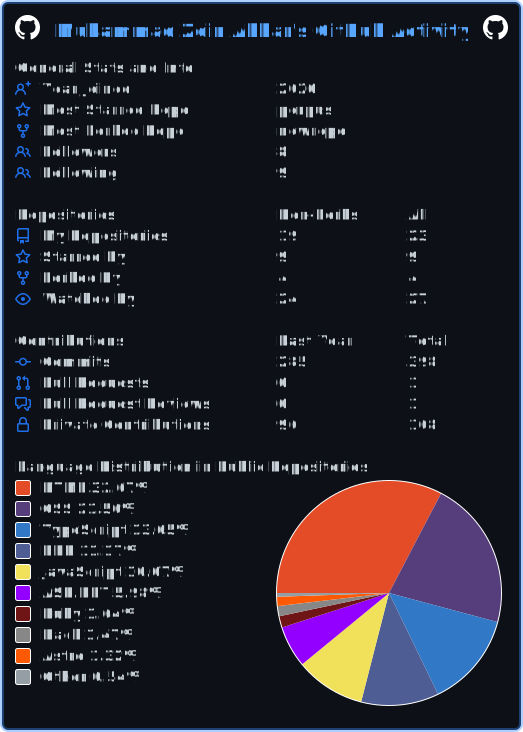

# 💫 About Me:
👋 Hi, I’m @zTzyrant a.k.a. Katachinx 👀 My Legal Name is Muhammad Zein Akbar 🌱 I’m currently learning at Angular 15 📫 Reach me ztzyrant@gmail.com  

## 🌐 Socials:
   

# 💻 Tech Stack:
                  
# 📊 GitHub Stats:
 
 

### ✍️ Random Dev Quote

---

<!-- Proudly created with GPRM ( https://gprm.itsvg.in ) -->

